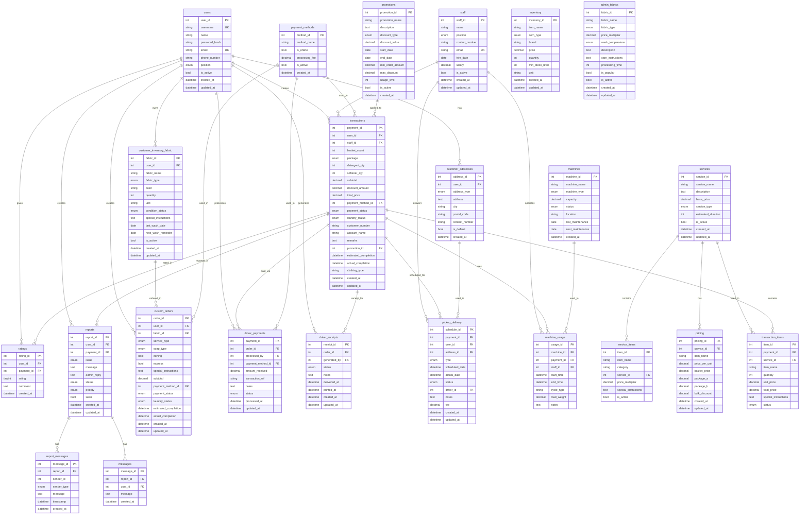

# Laundry Management System - ERD (Mermaid Format)

```mermaid
erDiagram
    users ||--o{ customer_addresses : "has"
    users ||--o{ transactions : "creates"
    users ||--o{ ratings : "gives"
    users ||--o{ reports : "creates"
    users ||--o{ customer_inventory_fabric : "owns"
    users ||--o{ custom_orders : "creates"
    users ||--o{ driver_payments : "processes"
    users ||--o{ driver_receipts : "generates"
    
    staff ||--o{ transactions : "handles"
    staff ||--o{ pickup_delivery : "delivers"
    staff ||--o{ machine_usage : "operates"
    
    services ||--o{ service_items : "contains"
    services ||--o{ pricing : "has"
    services ||--o{ transaction_items : "used_in"
    
    transactions ||--o{ transaction_items : "contains"
    transactions ||--o{ pickup_delivery : "scheduled_for"
    transactions ||--o{ machine_usage : "uses"
    transactions ||--o{ ratings : "rated_in"
    transactions ||--o{ reports : "reported_in"
    transactions ||--o{ driver_payments : "paid_via"
    transactions ||--o{ driver_receipts : "receipt_for"
    
    customer_addresses ||--o{ pickup_delivery : "used_in"
    customer_inventory_fabric ||--o{ custom_orders : "ordered_in"
    
    machines ||--o{ machine_usage : "used_in"
    payment_methods ||--o{ transactions : "used_in"
    payment_methods ||--o{ custom_orders : "used_in"
    payment_methods ||--o{ driver_payments : "used_in"
    promotions ||--o{ transactions : "applied_to"
    reports ||--o{ report_messages : "has"
    reports ||--o{ messages : "has"
    
    users {
        int user_id PK
        string username UK
        string name
        string password_hash
        string email UK
        string phone_number
        enum position
        bool is_active
        datetime created_at
        datetime updated_at
    }
    
    customer_addresses {
        int address_id PK
        int user_id FK
        enum address_type
        text address
        string city
        string postal_code
        string contact_number
        bool is_default
        datetime created_at
    }
    
    staff {
        int staff_id PK
        string name
        enum position
        string contact_number
        string email UK
        date hire_date
        decimal salary
        bool is_active
        datetime created_at
        datetime updated_at
    }
    
    services {
        int service_id PK
        string service_name
        text description
        decimal base_price
        enum service_type
        int estimated_duration
        bool is_active
        datetime created_at
        datetime updated_at
    }
    
    service_items {
        int item_id PK
        string item_name
        string category
        int service_id FK
        decimal price_multiplier
        text special_instructions
        bool is_active
    }
    
    machines {
        int machine_id PK
        string machine_name
        enum machine_type
        decimal capacity
        enum status
        string location
        date last_maintenance
        date next_maintenance
        datetime created_at
    }
    
    payment_methods {
        int method_id PK
        string method_name
        bool is_online
        decimal processing_fee
        bool is_active
        datetime created_at
    }
    
    promotions {
        int promotion_id PK
        string promotion_name
        text description
        enum discount_type
        decimal discount_value
        date start_date
        date end_date
        decimal min_order_amount
        decimal max_discount
        int usage_limit
        bool is_active
        datetime created_at
    }
    
    inventory {
        int inventory_id PK
        string item_name
        enum item_type
        string brand
        decimal price
        int quantity
        int min_stock_level
        string unit
        datetime created_at
        datetime updated_at
    }
    
    pricing {
        int pricing_id PK
        int service_id FK
        string item_name
        decimal price_per_unit
        decimal basket_price
        decimal package_a
        decimal package_b
        decimal bulk_discount
        datetime created_at
        datetime updated_at
    }
    
    transactions {
        int payment_id PK
        int user_id FK
        int staff_id FK
        int basket_count
        enum package
        int detergent_qty
        int softener_qty
        decimal subtotal
        decimal discount_amount
        decimal total_price
        int payment_method_id FK
        enum payment_status
        enum laundry_status
        string customer_number
        string account_name
        text remarks
        int promotion_id FK
        datetime estimated_completion
        datetime actual_completion
        string clothing_type
        datetime created_at
        datetime updated_at
    }
    
    transaction_items {
        int item_id PK
        int payment_id FK
        int service_id FK
        string item_name
        int quantity
        decimal unit_price
        decimal total_price
        text special_instructions
        enum status
    }
    
    pickup_delivery {
        int schedule_id PK
        int payment_id FK
        int user_id FK
        int address_id FK
        enum type
        datetime scheduled_date
        datetime actual_date
        enum status
        int driver_id FK
        text notes
        decimal fee
        datetime created_at
        datetime updated_at
    }
    
    machine_usage {
        int usage_id PK
        int machine_id FK
        int payment_id FK
        int staff_id FK
        datetime start_time
        datetime end_time
        string cycle_type
        decimal load_weight
        text notes
    }
    
    ratings {
        int rating_id PK
        int user_id FK
        int payment_id FK
        tinyint rating
        text comment
        datetime created_at
    }
    
    reports {
        int report_id PK
        int user_id FK
        int payment_id FK
        enum issue
        text message
        text admin_reply
        enum status
        enum priority
        bool seen
        datetime created_at
        datetime updated_at
    }
    
    report_messages {
        int message_id PK
        int report_id FK
        int sender_id
        enum sender_type
        text message
        datetime timestamp
        datetime created_at
    }
    
    messages {
        int message_id PK
        int report_id FK
        int user_id FK
        text message
        datetime created_at
    }
    
    driver_payments {
        int payment_id PK
        int order_id FK
        int processed_by FK
        int payment_method_id FK
        decimal amount_received
        string transaction_ref
        text notes
        enum status
        datetime processed_at
        datetime updated_at
    }
    
    driver_receipts {
        int receipt_id PK
        int order_id FK
        int generated_by FK
        enum status
        text notes
        datetime delivered_at
        datetime printed_at
        datetime created_at
        datetime updated_at
    }
    
    customer_inventory_fabric {
        int fabric_id PK
        int user_id FK
        string fabric_name
        enum fabric_type
        string color
        int quantity
        string unit
        enum condition_status
        text special_instructions
        date last_wash_date
        date next_wash_reminder
        bool is_active
        datetime created_at
        datetime updated_at
    }
    
    custom_orders {
        int order_id PK
        int user_id FK
        int fabric_id FK
        enum service_type
        enum soap_type
        bool ironing
        bool express
        text special_instructions
        decimal subtotal
        int payment_method_id FK
        enum payment_status
        enum laundry_status
        datetime estimated_completion
        datetime actual_completion
        datetime created_at
        datetime updated_at
    }
    
    admin_fabrics {
        int fabric_id PK
        string fabric_name
        enum fabric_type
        decimal price_multiplier
        enum wash_temperature
        text description
        text care_instructions
        int processing_time
        bool is_popular
        bool is_active
        datetime created_at
        datetime updated_at
    }
```

